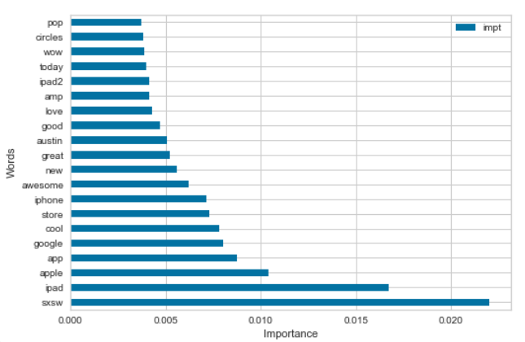
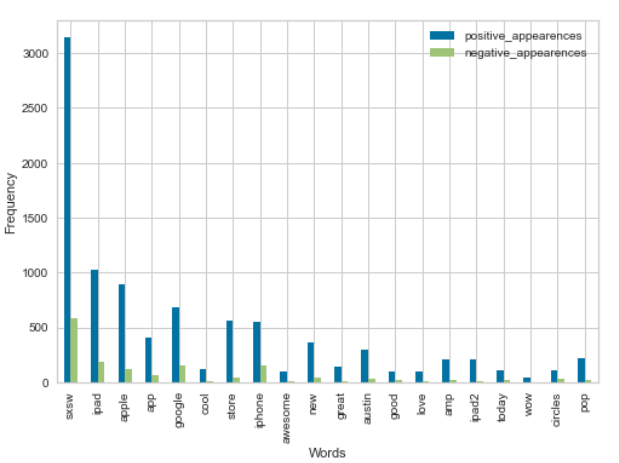

# Sentiment Analysis Through Natural Language Processing

## Presentation

## Goal

In this project I am to understand user sentiment about brands associated with Google and Apple on Twitter.

## Data

Using the included [dataset](judge-1377884607_tweet_product_company.csv) of roughly 9000 tweets, I created a number of models to try to gain an understanding of what led to a tweet being seen as having a positive, negative, or neutral sentiment. My first model simply counted the number of positively and negatively associated words in each tweet and scored them accordingly. This method gave me an accuracy of ~54%, better than the expected random guess accuracy of 33%.

Then I tried to beat this with logarithmic, decision tree, and random forest models. First I vectorized each word in each tweet using a Tf_IDF vectorizer which transforms words into numbers based on how common their usage is in the datset. Through the use of randomized search and then an itterative process on select hyperparameters I was able to achieve an accuracy score of ~69% in both a logistic model and a random forest model.

## Results

My results showed that words like iPad, Apple, and Google were relatively strong determinents for indicating that a tweet had a positive sentiment. The following graph shows the 20 most important words in the dataset towards determining sentiment

and this shows how common these words were in positive and negative tweets.

## Conclusion

Ultimately while some understanding of what went into tweet sentiment was uncovered there's much more progress that could be made. For one, these models consistantly overfit their training data at the expense of the test data and as a result they're not very generalizable. This might be addressable through the use of a wider array of model types. Another area where I think I could continue the project is by trying a variery of vectorization methods, including ones that factored in contextas well as the GloVe Vector set, which aims to encode actual semantic meaning.
